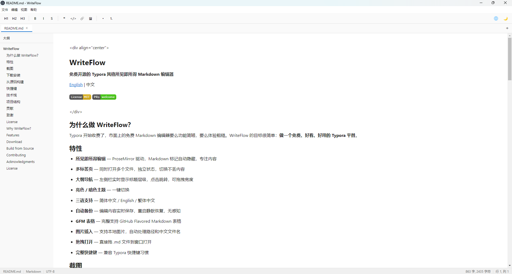
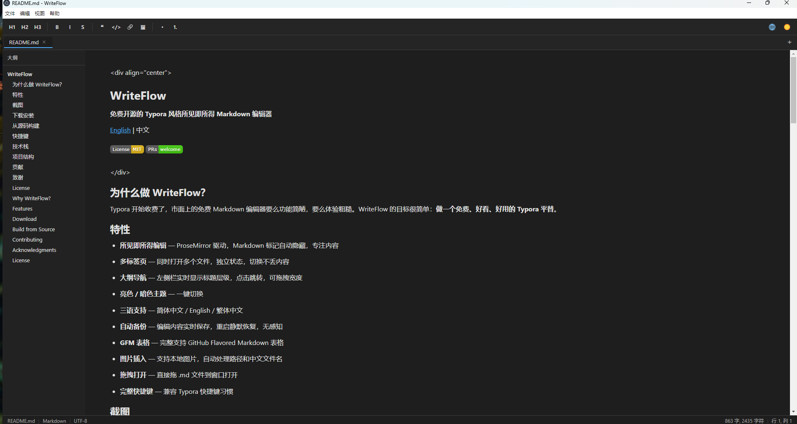

# WriteFlow

**免费开源的 Typora 风格所见即所得 Markdown 编辑器**

[English](#english) | 中文

[](https://www.gnu.org/licenses/gpl-3.0) [](CONTRIBUTING.md) [](https://github.com/jaqen6688/WriteFlow/releases)

## 为什么做 WriteFlow？

Typora 开始收费了，市面上的免费 Markdown 编辑器要么功能简陋，要么体验粗糙。WriteFlow 的目标很简单：**做一个免费、好看、好用的 Typora 平替**。

## 特性

* **所见即所得编辑** — ProseMirror 驱动，Markdown 标记自动隐藏，专注内容

* **多标签页** — 同时打开多个文件，独立状态，切换不丢内容

* **大纲导航** — 左侧栏实时显示标题层级，点击跳转，可拖拽宽度

* **代码高亮** — 代码块支持多语言语法高亮（highlight.js）

* **数学公式** — 支持 `$...$` 行内公式和 `$$...$$` 块级公式（KaTeX）

* **任务列表** — 支持 `- [ ]` / `- [x]` 待办事项，可点击切换

* **脚注** — 支持 `[^1]` 脚注引用和定义

* **GFM 表格** — 完整支持 GitHub Flavored Markdown 表格，含表头

* **亮色 / 暗色主题** — 一键切换

* **三语支持** — 简体中文 / English / 繁体中文

* **自动备份** — 编辑内容实时保存，重启静默恢复，无感知

* **图片插入** — 支持本地图片，自动处理路径和中文文件名

* **拖拽打开** — 直接拖 .md 文件到窗口打开

* **完整快捷键** — 兼容 Typora 快捷键习惯，Tab/Shift+Tab 列表缩进

## 截图

**亮色主题**



**暗色主题**



## 下载安装

前往 [Releases](https://github.com/jaqen6688/WriteFlow/releases) 下载对应平台安装包：

| 平台 | 文件 | 说明 |
| --- | --- | --- |
| Windows | `WriteFlow-x.x.x-windows.exe` | 双击安装即可 |
| macOS (Apple Silicon) | `WriteFlow-x.x.x-mac-arm64.dmg` | M1/M2/M3/M4 芯片的 Mac |
| macOS (Intel) | `WriteFlow-x.x.x-mac-x64.dmg` | Intel 芯片的 Mac |
| Linux | `WriteFlow-x.x.x-linux.AppImage` | 下载后 `chmod +x` 再双击运行 |

国内用户如无法访问 GitHub，可从百度网盘下载：[WriteFlow](https://pan.baidu.com/s/1m8Tad11Itl0Yw9D5kqBTpA?pwd=rlb2)（提取码：rlb2）

## 从源码构建

```bash
# 克隆仓库
git clone https://github.com/jaqen6688/writeflow.git
cd writeflow

# 安装依赖
npm install

# 开发模式
npm run dev

# 构建 Windows 安装包
npm run build:win
```

**环境要求**：Node.js >= 18，npm >= 9

## 快捷键

`Ctrl+/` 查看完整快捷键列表。

| 操作 | 快捷键 |
| --- | --- |
| 加粗 | `Ctrl+B` |
| 斜体 | `Ctrl+I` |
| 删除线 | `Ctrl+D` |
| 行内代码 | `Ctrl+E` |
| 链接 | `Ctrl+K` |
| 标题 1-6 | `Ctrl+Shift+1-6` |
| 正文 | `Ctrl+Shift+0` |
| 无序列表 | `Ctrl+Shift+8` |
| 有序列表 | `Ctrl+Shift+9` |
| 引用 | `Ctrl+Shift+Q` |
| 代码块 | `Ctrl+Shift+C` |
| 图片 | `Ctrl+Shift+I` |
| 打开文件 | `Ctrl+O` |
| 保存 | `Ctrl+S` |
| 另存为 | `Ctrl+Shift+S` |
| 新建标签页 | `Ctrl+N` |
| 快捷键帮助 | `Ctrl+/` |## 技术栈

| 技术 | 用途 |
| --- | --- |
| [Electron 31](https://www.electronjs.org/) | 桌面应用框架 |
| [React 18](https://react.dev/) | UI 层 |
| [ProseMirror](https://prosemirror.net/) | 富文本编辑引擎 |
| [markdown-it](https://github.com/markdown-it/markdown-it) | Markdown 解析 |
| [electron-vite](https://electron-vite.org/) | 构建工具 |
| [TypeScript](https://www.typescriptlang.org/) | 类型安全 |## 项目结构

```
src/
├── main/                    # Electron 主进程
│   ├── index.ts             # 窗口创建、自定义协议、IPC
│   ├── ipc.ts               # 文件操作
│   ├── menu.ts              # 应用菜单（i18n）
│   └── backup.ts            # 自动备份
├── preload/
│   └── index.ts             # 主进程↔渲染进程桥接
└── renderer/src/
    ├── App.tsx              # 应用入口
    ├── editor/              # ProseMirror 编辑器核心
    ├── hooks/               # React Hooks
    ├── components/          # UI 组件
    ├── i18n/                # 国际化
    ├── styles/              # 样式
    └── utils/               # 工具函数
```

## 贡献

欢迎贡献！请阅读 [贡献指南](CONTRIBUTING.md)。

## 致谢

WriteFlow 使用 Claude Code（AI 编程助手）辅助开发。项目从零到可用版本，大部分代码由 AI 生成、人工审核调试。这是一个 AI 辅助开发的真实案例。

## 联系作者

欢迎扫码添加微信交流


## License

[GPL v3](LICENSE) © Jaqen

---

<a name="english"></a>

## Why WriteFlow?

Typora went paid. Free Markdown editors are either feature-poor or have rough UX. WriteFlow aims to be a **free, polished, Typora-style WYSIWYG editor**.

## Demo


## Features

* **WYSIWYG editing** — ProseMirror-powered, Markdown syntax auto-hides

* **Multi-tab** — Open multiple files with independent states

* **Outline navigation** — Real-time heading hierarchy in sidebar

* **Syntax highlighting** — Multi-language code block highlighting (highlight.js)

* **Math formulas** — Inline `$...$` and block `$$...$$` math rendering (KaTeX)

* **Task lists** — `- [ ]` / `- [x]` checkboxes with click-to-toggle

* **Footnotes** — `[^1]` footnote references and definitions

* **GFM tables** — Full GitHub Flavored Markdown table support with headers

* **Light/Dark theme** — One-click toggle

* **i18n** — Simplified Chinese, English, Traditional Chinese

* **Auto backup** — Real-time save, silent recovery on restart

* **Image insertion** — Local images with automatic path handling

* **Drag & drop** — Drag .md files to open

* **Full keyboard shortcuts** — Typora-compatible, Tab/Shift+Tab list indentation

## Download

Go to [Releases](https://github.com/jaqen6688/WriteFlow/releases) for the latest installer:

| Platform | File | Notes |
| --- | --- | --- |
| Windows | `WriteFlow-x.x.x-windows.exe` | Double-click to install |
| macOS (Apple Silicon) | `WriteFlow-x.x.x-mac-arm64.dmg` | M1/M2/M3/M4 Macs |
| macOS (Intel) | `WriteFlow-x.x.x-mac-x64.dmg` | Intel-based Macs |
| Linux | `WriteFlow-x.x.x-linux.AppImage` | `chmod +x` then double-click |Users in China can download from Baidu Netdisk: [WriteFlow](https://pan.baidu.com/s/1m8Tad11Itl0Yw9D5kqBTpA?pwd=rlb2) (code: rlb2)

## Build from Source

```bash
git clone https://github.com/jaqen6688/writeflow.git
cd writeflow
npm install
npm run dev        # Development
npm run build:win  # Build Windows installer
```

**Requirements**: Node.js >= 18, npm >= 9

## Contributing

Contributions are welcome! Please read the [Contributing Guide](CONTRIBUTING.md).

## Acknowledgments

WriteFlow was built with the assistance of Claude Code (AI programming tool). Most of the codebase was AI-generated and human-reviewed — a real-world case of AI-assisted development.

## License

[GPL v3](LICENSE) © Jaqen